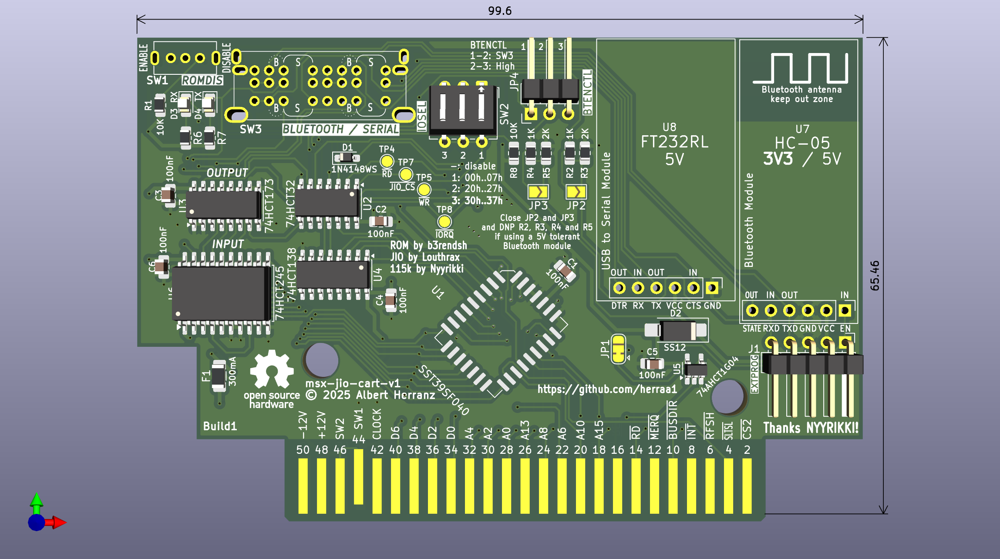
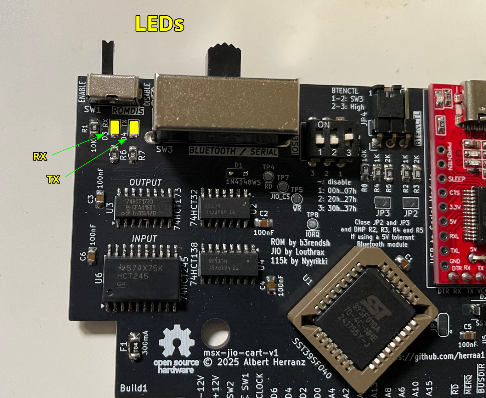
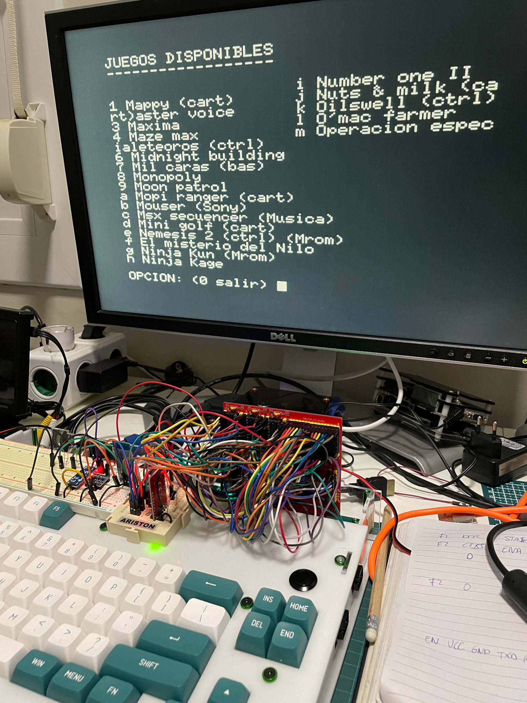

# MSX JIO CART

This is a simple MSX cartridge that allows software-based serial communications like MSXJIO but without using joystick port 2.

It includes:
* a flash ROM writable by either software (in-system from MSX-DOS) or hardware (using an external programmer)
* an I/O register to interface with embedded serial modules
  * address of I/O register is configurable between a set of predefined options
* one or two of these serial modules (only one active at a time):
  * a RT232RL-based USB Serial Module
  * a Bluetooth HC-05 Module
* a switch to select the active serial module
  * optional if only one module is populated

> [!NOTE]
> Documentation in progress

## Current Status

* First prototype PCB sent for manufacturing as of Dec 2nd 2025 (couldn't wait to confirm some footprints...).
* After a long wait, bare prototype PCBs arrived as of Jan 8th 2026. Now, let's find some time to assemble them and (cross fingers) hope I grabbed all needed components.
* First prototype successfully assembled and tested as of Jan 11th 2026.

## [Firmware](https://github.com/b3rendsh/msxdos2s/tree/main/jio/client)

The msx-jio-cart uses @b3rendsh [JIO clients](https://github.com/b3rendsh/msxdos2s/tree/main/jio/client) in ROM format.

You can flash the ROM in-system using [HRA!](https://github.com/hra1129)'s [WRTSST.COM](https://github.com/hra1129/MSX_MegaSCC_for_SST39SF040/tree/main/tools/wrtsst) from your MSX. Or you can flash the ROM using a hardware programmer like TL866II Plus and a tool like [minipro](https://gitlab.com/DavidGriffith/minipro/).

See [ROM Flashing Instructions](#rom-flashing-instructions).

## [Software](https://github.com/louthrax/MSXJIO)

The msx-jio-cart requires one of @louthrax [JIO Servers](https://github.com/louthrax/MSXJIO/releases).

On the JIO server, choose the connection method (Serial or Bluetooth) that matches your current msx-jio-cart serial module selection, according to switch _SW3_ BLUETOOTH/SERIAL.

## [Hardware](hardware/kicad/)

The msx-jio-cart is made of a 2-layer PCB with several SMD and through-hole components placed on the front layer only:

* a 6-pin serial RT232RL USB module with DTR, TX, RX, VCC, CTS and GND signals.
* a 6-pin serial HC-05 Bluetooth module with STATE, RXD, TXD, GND, VCC and EN signals.
* a SST39SF010 1Mbit (128Kbyte) flash ROM to store the JIO client ROM
* a switch to disable the ROM at boot time (required to re-program the flash ROM from the MSX itself)
* 74HCT32 and 74HCT138 ICs to implement the I/O address selection logic and control interface
* a DIP switch to configure the I/O address of the msx-jio-cart register
* 74HCT173 and 74HCT245 to implement the I/O register
* extra TX/RX leds to signal transmission events
* a switch to select the active serial module
* several jumpers to control the cartridge behavior and features
* a header to configure the bluetooth module externally if required
* a cartridge-wide fuse to protect the MSX slot 5V power rail in case of a cartridge malfunction
* a Schottky diode to prevent back-powering the MSX from the serial USB module
* other active and passive components, some of them optional

### [msx-jio-cart-v1-build1](hardware/kicad/msx-jio-cart-v1-build1/)

:white_check_mark: This board has been successfully built and tested.

[Bill Of Materials (BoM)](https://html-preview.github.io/?url=https://raw.githubusercontent.com/herraa1/msx-jio-cart-v1/main/hardware/kicad/msx-jio-cart-v1-build1/bom/ibom.html)

[Schematic and PCB](https://kicanvas.org/?github=https%3A%2F%2Fgithub.com%2Fherraa1%2Fmsx-jio-cart-v1%2Ftree%2Fmain%2Fhardware%2Fkicad%2Fmsx-jio-cart-v1-build1)

|||
|-|-|
|msx-jio-cart-v1 build1 PCB unpopulated front|msx-jio-cart-v1 build1 PCB unpopulated back|

||
|:--|
|msx-jio-cart-v1 build1 PCB populated front|

#### LED indicators

| **LED**   | **State**      | **Indication** |
|-----------|----------------|----------------|
| _RX_      | On             | data is being received from the MSX |
| _TX_      | On             | data is being sent to the MSX       |

#### Switches and Jumpers

| **Switch** | **Label**        | **State**          | **Purpose** |
|------------|------------------|--------------------|----------------|
| _SW1_      | ROMDIS           | **Enable**\*       | Enable Flash ROM for normal operation                                           |
| _SW1_      | ROMDIS           | Disable            | Disable Flash ROM (only for in-system programming)                              |
| _SW2_      | IOSEL            | 1,2,3 Off          | Disable I/O register (JIO CART unavailable)                                     |
| _SW2_      | IOSEL            | **1 On 2,3 Off**\* | Configure I/O register at 00h..07h                                              |
| _SW2_      | IOSEL            | 2 On 1,3 Off       | Configure I/O register at 20h..27h                                              |
| _SW2_      | IOSEL            | 3 On 1,2 Off       | Configure I/O register at 30h..37h                                              |
| _SW3_      | BLUETOOTH/SERIAL | **Left**\*         | Enable Bluetooth, leave EN floating (data mode) when JP4 1-2                    |
| _SW3_      | BLUETOOTH/SERIAL | Middle             | Enable Bluetooth, control EN from I/O register when JP4 1-2                     |
| _SW3_      | BLUETOOTH/SERIAL | **Right**\*        | Enable USB                                                                      |
| _JP4_      | BTENCTL          | **1-2**\*          | Control EN according to SW3 position                                            |
| _JP4_      | BTENCTL          | 2-3                | Set EN high unconditionally (AT mode)                                           |
| _JP3_      | -                | **Open**\*         | (Advanced) Populate R4 and R5, drive Bluetooth EN signal using 3V3 logic        |
| _JP3_      | -                | Closed             | (Advanced) Do NOT populate R4 and R5, drive Bluetooth EN signal using 5V logic  |
| _JP2_      | -                | **Open**\*         | (Advanced) Populate R2 and R3, drive Bluetooth RXD signal using 3V3 logic       |
| _JP2_      | -                | Closed             | (Advanced) Do NOT populate R2 nor R3, drive Bluetooth RXD signal using 5V logic |
| _JP1_      | -                | **1-2**\*          | (Advanced) Populate C5 and U5, MSX reset causes reset/zeroing of I/O reg        |
| _JP1_      | -                | 2-3                | (Advanced) Do NOT populate C5 nor U5, I/O reg is never reset/zeroed             |

\* Default settings

#### Headers

| **Header** | **Label**        | **Purpose** |
|------------|------------------|----------------|
| _J1_       | EXTPROG          | Allows to configure the Bluetooth module via AT commands externally |

### msx-jio-cart early prototype

## ROM Flashing Instructions

TBC

## Compatibility Tests

| **Model**                                                               | **msx-jio-cart v1 build1** |
|-------------------------------------------------------------------------|----------------------------|
| [Sony MSX HB-101P](https://www.msx.org/wiki/Sony_HB-101P)               |           test pending     |
| [Sony MSX HB-501F](https://www.msx.org/wiki/Sony_HB-501F)               |           OK               |
| [Toshiba MSX HX-10P](https://www.msx.org/wiki/Toshiba_HX-10P)           |           OK               |
| [Philips MSX2 VG-8235](https://www.msx.org/wiki/Philips_VG-8235)        |           OK               |
| [Panasonic MSX2+ FS-A1WSX](https://www.msx.org/wiki/Panasonic_FS-A1WSX) |           OK               |
| [Omega MSX2+](https://github.com/skiselev/omega)                        |           OK               |
| [Tides Rider](https://genami.shop/products/tides-rider-hdk)             |           OK               |
| [JFF-TMSHAT](https://github.com/herraa1/JFF-TMSHAT)                     |           OK               |

## Errata / Issues

* On some MSX systems, by design or due to the aging of some components, the voltage supplied to the cartridge slots is suboptimal and the bluetooth module of a msx-jio-cart with both USB and bluetooth modules installed may be slower or even randomly disconnect. The cause is likely the additional voltage drop within the cartridge due to the reverse current protection diode that protects the MSX from being back-powered from the USB serial module.

  A workaround for this problem affecting only the bluetooth module is to connect the msx-jio-cart USB port to a 5V USB power supply or data port of a computer, as the USB connector of the USB serial module can back-power the bluetooth module (but never the MSX). By doing this, the bluetooth module and USB serial module are powered directly by 5V from the USB connection.

## References

NYYRIKKI's 115200 bps routines
* https://www.msx.org/forum/msx-talk/development/software-rs-232-115200bps-on-msx

b3rendsh msxdos2s
* https://github.com/b3rendsh/msxdos2s

Louthrax MSXJIO
* https://github.com/louthrax/MSXJIO

Skoti's Spider Flash Cart
* https://github.com/konkotgit/MSX-Spider-Flash-Cart

Danjovic Soda-IDE
* https://github.com/Danjovic/Soda-IDE
