# MSX JIO CART

This is a simple MSX cartridge that allows software-based serial communications like MSXJIO but without using joystick port 2.

It includes:
* a flash ROM writable by either software (in-system from MSX-DOS) or hardware (using an external programmer)
* an I/O register to interface with the embedded serial modules
  * address of I/O register is configurable between a set of predefined options
* one or two of these serial modules (only one active at a time):
  * a RT232RL-based USB serial module
  * a Bluetooth HC-05 module
* a switch to select the active serial module
  * optional if only one module is populated

What can I do with a msx-jio-cart?

* serve a hard or floppy disk-image from a host computer (or smartphone) to your MSX, through high-speed 115200 bauds communication (either USB or Bluetooth)
* more things to come

## Current Status

* First prototype PCB sent for manufacturing as of Dec 2nd 2025 (couldn't wait to confirm some footprints...).
* After a long wait, bare prototype PCBs arrived as of Jan 8th 2026. Now, let's find some time to assemble them and (cross fingers) hope I grabbed all needed components.
* First build1 prototype successfully assembled and tested as of Jan 11th 2026.
* Another build1 cartridge successfully assembled and tested as of Jan 30th 2026.
* Third build1 cartridge successfully assembled and tested as of Feb 9th 2026.

> [!NOTE]
> Documentation in progress

## Quick Start Guide

Build and Setup
* Assemble the msx-jio-cart
* [Flash the onboard ROM](#rom-flashing-instructions)
* [Choose an I/O address](#setting-the-cartridge-io-address)
* [Setup the Bluetooth module](#bluetooth-module-setup-instructions) (if populated)
* [Set normal operation mode](#selecting-normal-operation-modes-usb-serial-and-bluetooth)

Using USB serial mode
* Move switch _SW3_ `BLUETOOTH/SERIAL` to the `right` position to use [USB serial mode](#usb-serial-mode)
* Make sure the MSX computer is powered off
* Insert the msx-jio-cart into a free slot of the MSX computer
* Connect a USB cable from your computer to the msx-jio-cart USB port (the USB and Bluetooth modules will power up)
* On your computer, prepare the disk image to be served and start the [JIO Server](https://github.com/louthrax/MSXJIO?tab=readme-ov-file#server-details) in USB serial mode
* On the JIO Server, select the correct USB device and press the connect button
* Power on the MSX computer
* The ROM will try to boot from the disk image

Using Bluetooth mode
* Move switch _SW3_ `BLUETOOTH/SERIAL` to the `left` position to use [Bluetooth mode](#bluetooth-mode)
* Make sure the MSX computer is powered off
* Insert the msx-jio-cart into a free slot of the MSX computer
* Prepare the disk image to be served and start the [JIO Server](https://github.com/louthrax/MSXJIO?tab=readme-ov-file#server-details) in Bluetooth mode
* Power on the MSX computer
* If not already done, pair your computer or Android device to the msx-jio-cart Bluetooth module
* On the JIO Server, select the correct Bluetooth device and press the connect button
* The ROM will try to boot from the disk image

## [Firmware](https://github.com/b3rendsh/msxdos2s/tree/main/jio/client)

The msx-jio-cart uses @b3rendsh [JIO clients](https://github.com/b3rendsh/msxdos2s/tree/main/jio/client) in ROM format.

There are two different ROMs available:
* MSX-DOS1 ROM [jio_dos1.rom](https://github.com/b3rendsh/msxdos2s/blob/main/jio/client/jio_dos1.rom)
  * enhanced MSX-DOS 1
  * best suited for MSX1 machines with 64K of memory
* MSX-DOS2 ROM [jio_dos2.rom](https://github.com/b3rendsh/msxdos2s/blob/main/jio/client/jio_dos2.rom)
  * enhanced MSX-DOS 2.2 / 2.31
  * works on MSX1 or higher but requires at least 128K or more RAM mapper

You can flash the ROM in-system using [HRA!](https://github.com/hra1129)'s [WRTSST.COM](https://github.com/hra1129/MSX_MegaSCC_for_SST39SF040/tree/main/tools/wrtsst) from your MSX. Or you can flash the ROM using a hardware programmer like TL866II Plus and a tool like [minipro](https://gitlab.com/DavidGriffith/minipro/).

See [ROM Flashing Instructions](#rom-flashing-instructions).

## [Software](https://github.com/louthrax/MSXJIO)

The msx-jio-cart requires one of @louthrax [JIO Servers](https://github.com/louthrax/MSXJIO/releases) to serve disk images to an MSX computer.

The JIO Server runs on a Windows, Linux or Mac computer, or alternatively on an Android device.

On the JIO server, you can select which disk image to serve and which connection method (USB serial or Bluetooth) to use. The connection method must match your current msx-jio-cart serial module selection, according to switch _SW3_ `BLUETOOTH/SERIAL`.

## [Hardware](hardware/kicad/)

The msx-jio-cart is made of a 2-layer PCB with several SMD and through-hole components placed on the front layer only:

* a 6-pin serial RT232RL USB module with DTR, TX, RX, VCC, CTS and GND signals.
* a 6-pin serial HC-05 Bluetooth module with STATE, RXD, TXD, GND, VCC and EN signals.
* a SST39SF010 1Mbit (128Kbyte) flash ROM to store the JIO client ROM
* a switch to disable the ROM at boot time (required to re-program the flash ROM from the MSX itself)
* 74HCT32 and 74HCT138 ICs to implement the I/O address selection logic and control interface
* a DIP switch to configure the I/O address of the msx-jio-cart register
* 74HCT173 and 74HCT245 to implement the I/O register
* extra TX/RX leds to signal data transmission events
* a switch to select the active serial module
* several jumpers to control the cartridge behavior and features
* a header to configure the Bluetooth module externally if required
* a cartridge-wide fuse to protect the MSX slot 5V power rail in case of a cartridge malfunction
* a Schottky diode to prevent back-powering the MSX from the serial USB module
* other active and passive components, some of them optional

### [msx-jio-cart-v1-build1](hardware/kicad/msx-jio-cart-v1-build1/)

:white_check_mark: This board has been successfully built and tested.

[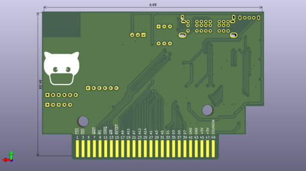](images/msx-jiocart-v1-back-render.png)

[Bill Of Materials (BoM)](https://html-preview.github.io/?url=https://raw.githubusercontent.com/herraa1/msx-jio-cart-v1/main/hardware/kicad/msx-jio-cart-v1-build1/bom/ibom.html)

[Schematic and PCB](https://kicanvas.org/?github=https%3A%2F%2Fgithub.com%2Fherraa1%2Fmsx-jio-cart-v1%2Ftree%2Fmain%2Fhardware%2Fkicad%2Fmsx-jio-cart-v1-build1)

|[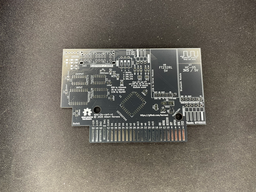](images/msx-jiocart-v1-front-unpopulated-8742.png)|[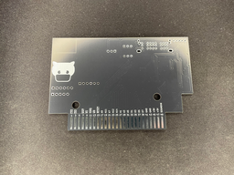](images/msx-jiocart-v1-back-unpopulated-8743.png)|
|-|-|
|msx-jio-cart-v1 build1 PCB unpopulated front|msx-jio-cart-v1 build1 PCB unpopulated back|

|[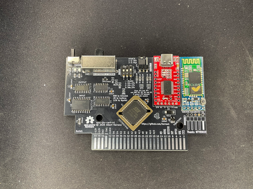](images/msx-jiocart-v1-front-populated-serial-and-bluetooth-8744.png)|
|:--|
|msx-jio-cart-v1 build1 PCB populated front|

#### LED indicators

[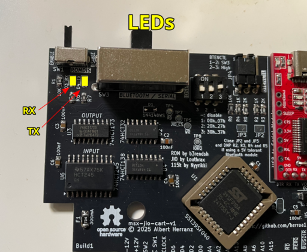](images/msx-jiocart-v1-build1-leds.png)

| **LED**   | **State**      | **Indication** |
|-----------|----------------|----------------|
| _RX_      | On             | data is being received from the MSX |
| _TX_      | On             | data is being sent to the MSX       |

#### Switches and Jumpers

[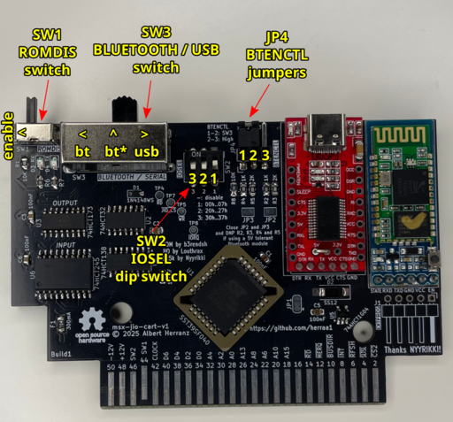](images/msx-jiocart-v1-build1-switches-and-jumpers.png)

| **Switch/Jumper** | **Label**          | **State**          | **Purpose**    |
|-------------------|--------------------|--------------------|----------------|
| _SW1_             | `ROMDIS`           | **Enable**\*       | Enable Flash ROM for normal operation                                           |
| _SW1_             | `ROMDIS`           | Disable            | Disable Flash ROM (only for in-system programming)                              |
| _SW2_             | `IOSEL`            | 1,2,3 Off          | Disable I/O register (JIO CART unavailable)                                     |
| _SW2_             | `IOSEL`            | **1 On 2,3 Off**\* | Configure I/O register at 00h..07h                                              |
| _SW2_             | `IOSEL`            | 2 On 1,3 Off       | Configure I/O register at 20h..27h                                              |
| _SW2_             | `IOSEL`            | 3 On 1,2 Off       | Configure I/O register at 30h..37h                                              |
| _SW3_             | `BLUETOOTH/SERIAL` | **Left**\*         | Enable Bluetooth, leave EN floating (data mode) when JP4 1-2                    |
| _SW3_             | `BLUETOOTH/SERIAL` | Middle             | Enable Bluetooth, control EN from I/O register when JP4 1-2                     |
| _SW3_             | `BLUETOOTH/SERIAL` | **Right**\*        | Enable USB                                                                      |
| _JP4_             | `BTENCTL`          | **1-2**\*          | Control EN according to SW3 position                                            |
| _JP4_             | `BTENCTL`          | 2-3                | Set EN high unconditionally (AT mode)                                           |

\* Default settings

#### Advanced jumpers

| **Jumper** | **Label**        | **State**          | **Purpose**    |
|------------|------------------|--------------------|----------------|
| _JP3_      | -                | **Open**\*         | (Advanced) Populate R4 and R5, drive Bluetooth EN signal using 3V3 logic        |
| _JP3_      | -                | Closed             | (Advanced) Do NOT populate R4 and R5, drive Bluetooth EN signal using 5V logic  |
| _JP2_      | -                | **Open**\*         | (Advanced) Populate R2 and R3, drive Bluetooth RXD signal using 3V3 logic       |
| _JP2_      | -                | Closed             | (Advanced) Do NOT populate R2 nor R3, drive Bluetooth RXD signal using 5V logic |
| _JP1_      | -                | **1-2**\*          | (Advanced) Populate C5 and U5, MSX reset causes reset/zeroing of I/O reg        |
| _JP1_      | -                | 2-3                | (Advanced) Do NOT populate C5 nor U5, I/O reg is never reset/zeroed             |

\* Default settings

#### Headers

[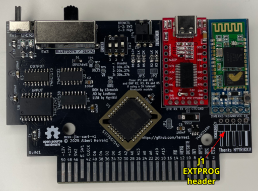](images/msx-jiocart-v1-build1-headers.png)

| **Header** | **Label**        | **Purpose**    |
|------------|------------------|----------------|
| _J1_       | `EXTPROG`        | Allows to configure the Bluetooth module via AT commands externally |

## Cartridge Initial Setup

Setting up the msx-jio-cart for the first time involves the following tasks:
* flashing the onboard ROM
* choosing an I/O address
* and setting up the Bluetooth module (if populated)

### ROM Flashing Instructions

#### Flashing the ROM from MSX-DOS

[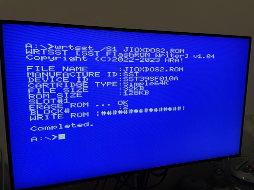](images/msx-jiocart-v1-flashing-with-wrtsst.png)

1. Prepare your bootable MSX-DOS media (a floppy disk, a mass storage device, etc.)
2. Copy [WRTSST.COM](https://github.com/hra1129/MSX_MegaSCC_for_SST39SF040/blob/main/tools/wrtsst/WRTSST.COM) to your MSX-DOS media
3. Copy the JIO client ROMs [jio_dos1.rom](https://github.com/b3rendsh/msxdos2s/blob/main/jio/client/jio_dos1.rom) for DOS 1.x and [jio_dos2.rom](https://github.com/b3rendsh/msxdos2s/blob/main/jio/client/jio_dos2.rom) for DOS 2.x to your MSX-DOS media
4. Move the _SW1_ `ROMDIS` switch to the _disabled_ position (see [Switches and jumpers](#switches-and-jumpers))
5. With your MSX powered off, insert your bootable MSX-DOS media and insert the msx-jio-cart into an empty slot
6. Power on and boot your MSX with your MSX-DOS media
7. Once on the MSX-DOS prompt, move the _SW1_ `ROMDIS` switch to the _enabled_ position (see [Switches and jumpers](#switches-and-jumpers))

> [!WARNING]
> Make sure you select the right slot before using `WRTSST.COM`.
> If you select the wrong slot, or do not select a slot, and you happen to have other `SST39SF*` compatible Flash ROMs in your MSX system, you may end up erasing and overwriting the wrong IC.

8. To flash the `jio_dos1.rom` into the _msx-jio-cart_ inserted in _slot 1_, execute the following command in the MSX-DOS prompt:

   ~~~Shell
   WRTSST /S1 JIO_DOS1.ROM
   ~~~

   Change the /Sx parameter to the actual slot number where the msx-jio-cart is inserted.

8. To flash the `jio_dos2.rom` into the _msx-jio-cart_ inserted in _slot 1_, execute the following command in the MSX-DOS prompt:

   ~~~Shell
   WRTSST /S1 JIO_DOS2.ROM
   ~~~

   Change the /Sx parameter to the actual slot number where the msx-jio-cart is inserted.

#### Flashing the ROM using a TL866II Plus and minipro from Linux

1. Install [minipro](https://gitlab.com/DavidGriffith/minipro/) into your Linux box
2. Insert the `SST39SF010` PLLC32 Flash ROM IC into a PLCC32 to DIP32 adapter, taking into account the orientation markings
3. Insert the PLCC32 to DIP32 adapter into the `TL866II Plus`, again taking into account the orientation markings
4. Connect your `TL866II Plus` to a USB port of your Linux box
5. Check that the Flash ROM IC is correctly identified.
   It should indicate a Chip ID of `0xBFB5`.

   ~~~bash
   ./minipro -p SST39SF010@PLCC32 -D
   ~~~
   ~~~
   Found TL866II+ 04.2.132 (0x284)
   Device code: 02114104
   Serial code: DVJZVC8IFBXAEQ55JFIU
   USB speed: 12Mbps (USB 1.1)
   Chip ID: 0xBFB5  OK
   ~~~

6. Build a 128K file named `128kdos1.bin` with the `jio_dos1.rom` contents at the correct offset executing the following command:

   ~~~bash
   cat <(dd if=/dev/zero ibs=16k count=1 | LC_ALL=C tr "\000" "\377") jio_dos1.rom <(dd if=/dev/zero ibs=96k count=1 | LC_ALL=C tr "\000" "\377") > 128kdos1.bin
   ~~~

7. Build a 128K file named `128kdos2.bin` with the `jio_dos2.rom` contents at the correct offset executing the following command:

   ~~~bash
   cat <(dd if=/dev/zero ibs=16k count=1 | LC_ALL=C tr "\000" "\377") jio_dos2.rom <(dd if=/dev/zero ibs=80k count=1 | LC_ALL=C tr "\000" "\377") > 128kdos2.bin
   ~~~

8. To flash the `128kdos1.bin` for DOS 1.x into the Flash ROM, execute the following command:

   ~~~bash
   ./minipro -p SST39SF010@PLCC32 -w 128kdos1.bin
   ~~~
   ~~~
   Found TL866II+ 04.2.132 (0x284)
   Device code: 02114104
   Serial code: DVJZVC8IFBXAEQ55JFIU
   USB speed: 12Mbps (USB 1.1)
   Chip ID: 0xBFB5  OK
   Erasing... 0.40Sec OK
   Writing Code...  6.40Sec  OK
   Reading Code...  0.98Sec  OK
   Verification OK
   ~~~

9. To flash the `128kdos2.bin` for DOS 2.x into the Flash ROM, execute the following command:

   ~~~bash
   ./minipro -p SST39SF010@PLCC32 -w 128kdos2.bin
   ~~~
   ~~~
   Found TL866II+ 04.2.132 (0x284)
   Device code: 02114104
   Serial code: DVJZVC8IFBXAEQ55JFIU
   USB speed: 12Mbps (USB 1.1)
   Chip ID: 0xBFB5  OK
   Erasing... 0.40Sec OK
   Writing Code...  6.40Sec  OK
   Reading Code...  0.98Sec  OK
   Verification OK
   ~~~

### I/O Address Selection

See [Setting the cartridge I/O address](#setting-the-cartridge-io-address).

### Bluetooth Module Setup Instructions

Using the JIO Server with Bluetooth requires preparing the msx-jio-cart Bluetooth module for 115200 bauds operation.
Also, assigning a unique name to the Bluetooth module is recommended to easily locate the right msx-jio-cart.

This setup is only needed when setting up the Bluetooth module for the first time.

#### Selecting Bluetooth AT configuration mode at 38400 bauds

In this mode, the Bluetooth module can be configured via AT commands using a fixed 38400 baud rate, irrespective of the currently configured baud rate at the module.

To enable Bluetooth AT configuration mode at 38400 bauds, remove the msx-jio-cart from the MSX computer and move the _SW1_ `ROMDIS` handle to the `right` (disable) position, move the _SW3_ `BLUETOOTH/SERIAL` handle to the `left` (Bluetooth) position and set the _JP4_ `BTENCTL` jumper to the `2-3` position.

| **Switch/Jumper** | **Label**          | **State**          | **Purpose**    |
|-------------------|--------------------|--------------------|----------------|
| _SW1_             | `ROMDIS`           | Disable            | Disable Flash ROM (only for in-system programming or HC-05 re-configuration)    |
| _SW3_             | `BLUETOOTH/SERIAL` | **Left**\*         | Enable Bluetooth, leave EN floating (data mode) when JP4 1-2                    |
| _JP4_             | `BTENCTL`          | 2-3                | Set EN high unconditionally (AT mode)                                           |

[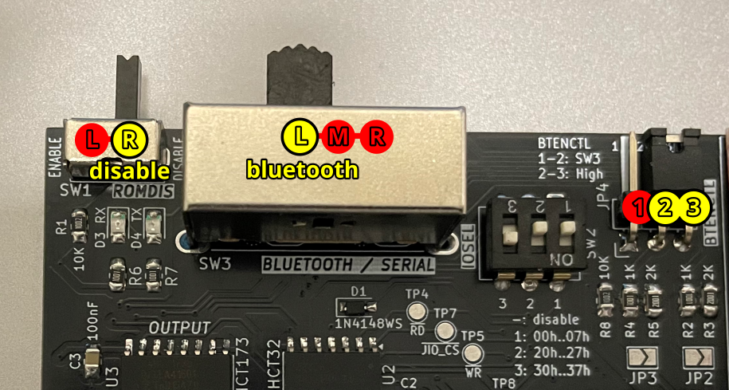](images/msx-jiocart-ATmode.png)

##### Identifying AT mode 38400 baud state

A msx-jio-cart inserted into a MSX cartridge slot, powered on and configured in Bluetooth AT configuration mode at 38400 bauds, shows the following Bluetooth module LED pattern continuously:
* the LED goes on for 2 seconds approximately
* and then goes off for 1 second

[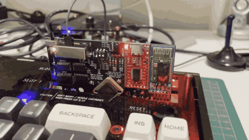](images/msx-jiocart-bluetooth-led-blinking-atmode.gif)

#### Using the JIOC38K MSX tool to configure the Bluetooth module

The JIOC38K tool can be run from a MSX computer to send AT commands at 38400 bauds to the msx-jio-cart Bluetooth module when operating in 38400 baud rate AT mode. The tool can be launched from BASIC either from tape or disk.

##### Loading JIOC38K from tape

1. Make sure your MSX computer is powered off
2. Insert the msx-jio-cart cartridge [configured for AT 38400 mode](#selecting-bluetooth-at-configuration-mode-at-38400-bauds) into a free cartridge slot of your MSX computer
3. Connect the tape interface of your MSX computer to a computer or mobile device with an audio jack output connector and able to play WAV files
4. Power on your MSX and proceed to the BASIC prompt
5. Type the following instruction to load JIOC38K from tape and press `Enter`
   ~~~bash
   RUN"CAS:
   ~~~
6. From the computer or mobile device, play the [JIOC38K.wav](software/JIOC38K.wav) file
7. On the MSX computer, a tape record named J38K will be found, and the JIOC38K tool will load and run

   [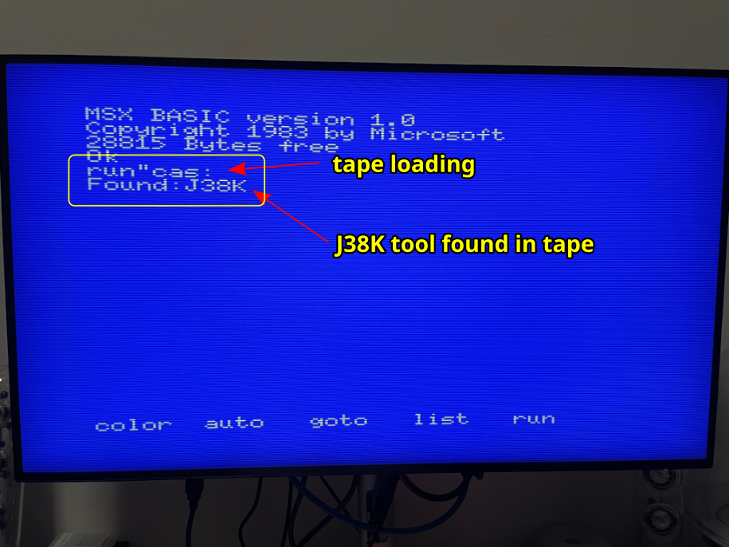](images/j38k-load-from-tape.png)

##### Loading JIOC38K from disk (or other media)

Using an auxiliar computer:
1. Prepare your MSX-DOS media (a floppy disk, a mass storage device, etc.)
2. Copy [JIOC38K.BAS](software/JIOC38K.BAS) and [JIOC38K.BIN](software/JIOC38K.BIN) to your MSX-DOS media

Using your MSX computer:
1. Make sure your MSX computer is powered off
2. Insert the msx-jio-cart cartridge [configured for AT 38400 mode](#selecting-bluetooth-at-configuration-mode-at-38400-bauds) into a free cartridge slot of your MSX computer
3. Power on your MSX computer and make sure you are at the BASIC prompt
4. With the MSX-DOS media inserted. type the following instruction to load JIOC38K from media and press `Enter`

   ~~~bash
   RUN"JIOC38K.BAS
   ~~~

   

##### Using JIOC38K

These are general guidelines when using JIOC38K:
* The JIOC38K tool will report on startup the currently configured I/O address of the msx-jio-cart if detected.

  [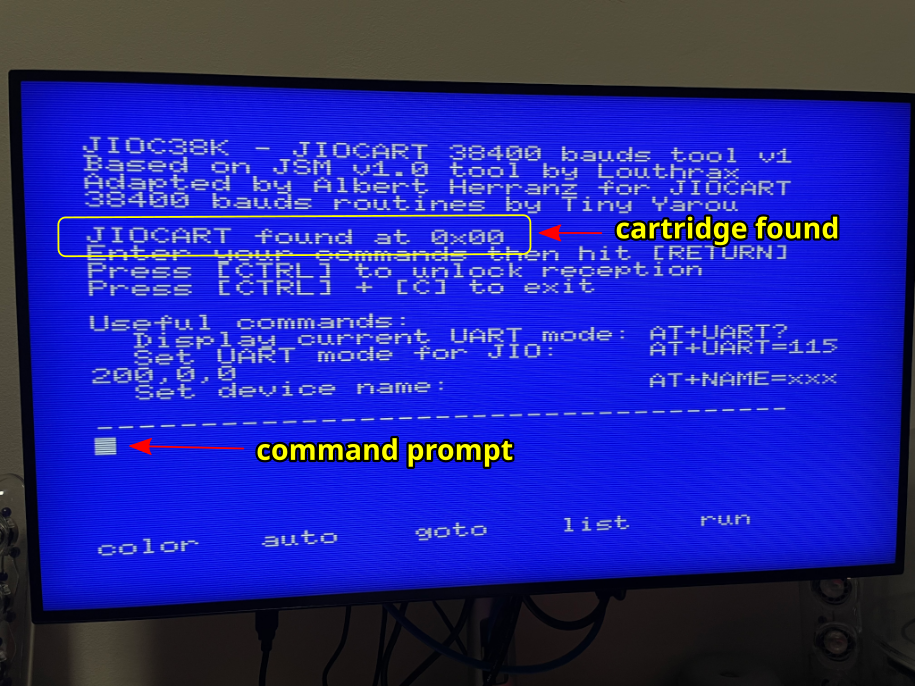](images/j38k-main-screen-cart-found.png)

* If no msx-jio-cart is detected, the JIOC38K tool will error out and exit to BASIC.

  [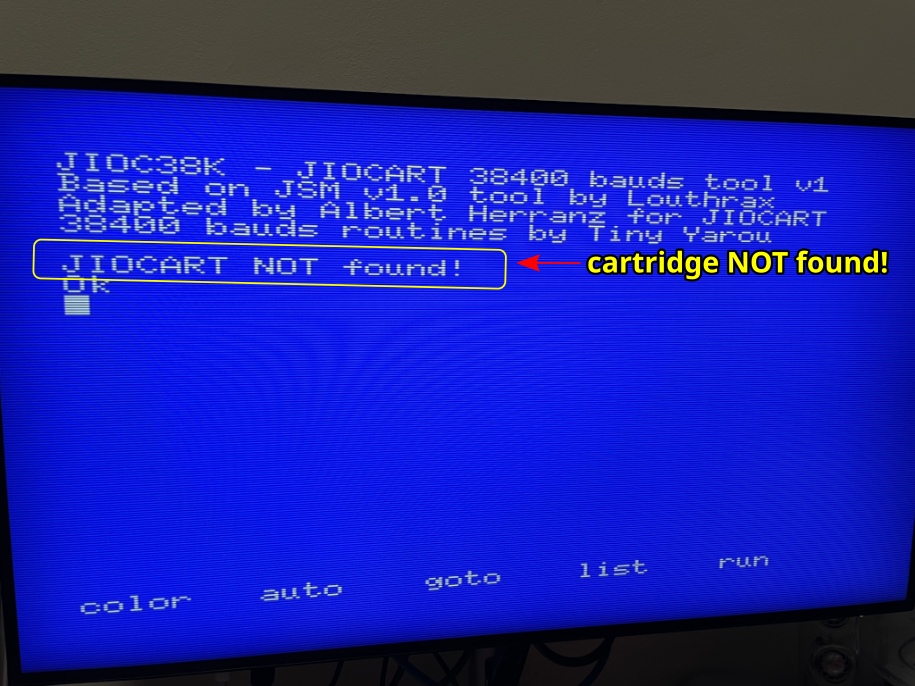](images/j38k-main-screen-cart-not-found.png)

* AT commands can be entered freely as in BASIC mode: an AT command will only be sent once `Enter` is pressed over the line with the command.
* If you receive an `ERROR` response, check the AT command for proper syntax and try again.
* The very first AT command executed may fail.
* Pressing and releasing the `CTRL` key forces cancellation of reply reception mode in case that the Bluetooth module does not provide a reply to a command.
* Pressing `CTRL-C` exits JIOC38K and returns to the BASIC prompt.

On your MSX computer:
* Type `AT` and press `Enter` to check if you can communicate with the Bluetooth module using AT commands.
  The Bluetooth module will reply with an `OK` prompt if everything works right. If you receive an error or a garbled reply, repeat the command until you get an `OK`reply.
* Type `AT+NAME=yourname` and press `Enter` to name the Bluetooth module with `yourname`.
* Type `AT+UART=115200,0,0` and press `Enter` to configure the Bluetooth module for 115200 baud operation.
* Type `AT+NAME?` and press `Enter` to check the configured name.
* Type `AT+UART?` and press `Enter` to check the configured baudrate.

  [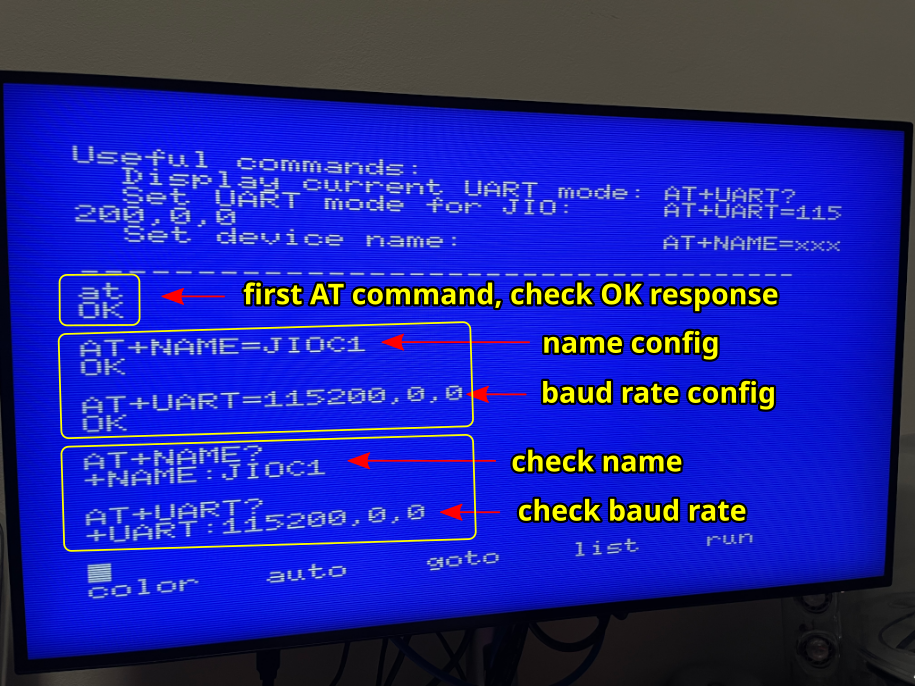](images/j38k-at-config.png)

The new configuration is automatically saved to the Bluetooth module.

Once finished, power off your MSX computer and re-configure the msx-jio-cart for [Bluetooth normal operation](#bluetooth-mode).

## Cartridge Operation

### Setting the cartridge I/O address

With the cartridge removed from the MSX and without power applied, slide only one of the three switches in the _SW2_ `IOSEL` DIP switch to the `ON` position to select one of the possible I/O address ranges.

See the [Switches and jumpers](#switches-and-jumpers) section to determine which I/O address range is enabled by each switch.

> [!WARNING]
> Make sure that the I/O address selected does not overlap any other I/O address used by other cartridges connected to the MSX computer.
>
> If unsure, check your other MSX cartridges documentation and/or [Grauw list of I/O ports](https://map.grauw.nl/resources/msx_io_ports.php).

> [!NOTE]
> Depending on which orientation was used when the DIP switch was soldered, the numbering and the `ON` position side may be different. Always use the numbering of the cartridge silkscreen to identify the `1`, `2` and `3` switches (not the numbering of the DIP switch) and always use the DIP switch `ON` position marking to determine the ON position.

> [!TIP]
> The JIO function of the MSX JIO cartridge can be disabled by setting all of the `1`, `2` and `3` switches to the `OFF` position. 

### Selecting normal operation modes (USB serial and Bluetooth)

In normal operation modes, make sure the _SW1_ `ROMDIS` handle is in the `left` (enable) position and the _JP4_ `BTENCTL` jumper is in the `1-2` position.

| **Switch/Jumper** | **Label**          | **State**          | **Purpose**    |
|-------------------|--------------------|--------------------|----------------|
| _SW1_             | `ROMDIS`           | **Enable**\*       | Enable Flash ROM for normal operation                                           |
| _JP4_             | `BTENCTL`          | **1-2**\*          | Control EN according to SW3 position                                            |

#### USB serial mode

To enable USB serial mode move the _SW3_ `BLUETOOTH/SERIAL` handle to the `right` (USB serial) position, and make sure _SW1_ is already setup for [normal operation mode](#selecting-normal-operation-modes-usb-serial-and-bluetooth).

| **Switch/Jumper** | **Label**          | **State**          | **Purpose**    |
|-------------------|--------------------|--------------------|----------------|
| _SW3_             | `BLUETOOTH/SERIAL` | **Right**\*        | Enable USB                                                                      |

[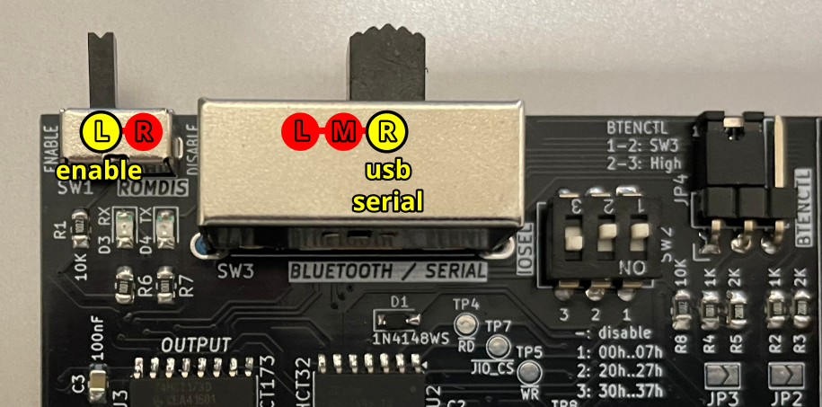](images/msx-jiocart-usb-mode.png)

##### Identifying USB serial mode

In USB serial mode, the USB module RX and TX LEDs blink at the same time as the cartridge RX and TX LEDs.

[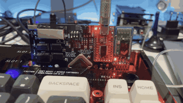](images/msx-jiocart-usb-led-blinking.gif)

#### Bluetooth mode

To enable Bluetooth mode move the _SW3_ `BLUETOOTH/SERIAL` handle to the `left` or `middle` (Bluetooth) position, and make sure _SW1_ and _JP4_ are already setup for [normal operation mode](#selecting-normal-operation-modes-usb-serial-and-bluetooth).

This mode should only be used once the Bluetooth module has been configured at 115200 bauds.

| **Switch/Jumper** | **Label**          | **State**          | **Purpose**    |
|-------------------|--------------------|--------------------|----------------|
| _SW3_             | `BLUETOOTH/SERIAL` | **Left**\*/Middle  | Enable Bluetooth                                                                |

[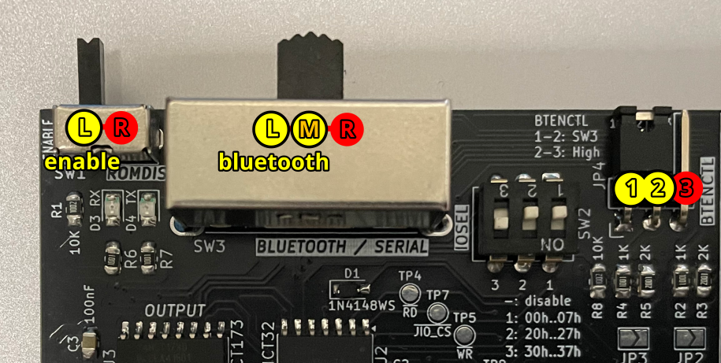](images/msx-jiocart-bluetooth-mode.png)

##### Identifying non-paired/unconnected state Bluetooth mode

In this mode, the Bluetooth module is waiting for another unpaired device to pair, or from a previously paired device to connect. The LED blinks 5 times per second approximately.

[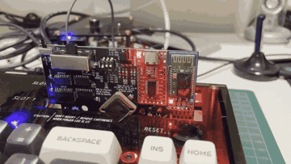](images/msx-jiocart-bluetooth-led-blinking-unpaired.gif)

##### Identifying connected state Bluetooth mode

In this mode, the Bluetooth module is connected to a paired device. The LED blinks twice in a second, then goes off for two seconds, repeating this pattern continuously.

[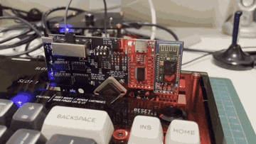](images/msx-jiocart-bluetooth-led-blinking-paired.gif)

## Cartridge Programming Interface

The msx-jio-cart implements a single 8-bit I/O register in the MSX Z80 [I/O address](#setting-the-cartridge-io-address) space for Bluetooth and USB serial module data and control.

### I/O Register Format

Register format guidelines:
* IN direction is from module to MSX
* OUT direction is from MSX to module
* LSB is bit 0, MSB is bit 7
* Data bits are common to USB serial and Bluetooth modes
* Control bits are specific to each module
* Output control bits have safe defaults for normal operation

#### Register format for USB serial mode

| **bit** | **type** | **direction** | **description**                                                                                           |
| ------- | -------- | ------------- | --------------------------------------------------------------------------------------------------------- |
| 0       | data     | IN            | data received from USB serial to MSX                                                                      |
| 1       | control  | IN            | serial data terminal ready (`DTR`)                                                                        |
| 2       | data     | IN/OUT        | transmit data from MSX to USB serial when written, last data transmitted from MSX to USB serial when read |
| 3       | control  | IN/OUT        | serial clear to send (`CTS`) when written, last `CTS` value written when read                             |
| 4       | control  | IN            | always 0                                                                                                  |
| 5       | control  | IN            | always 0                                                                                                  |
| 6       | data     | IN            | last data transmitted from MSX to USB serial                                                              |
| 7       | control  | IN            | last `CTS` value written                                                                                  |

#### Register format for Bluetooth mode

| **bit** | **type** | **direction** | **description**                                                                                                                 |
| ------- | -------- | ------------- | ------------------------------------------------------------------------------------------------------------------------------- |
| 0       | data     | IN            | data received from Bluetooth to MSX                                                                                             |
| 1       | control  | IN            | `state` of Bluetooth connection, as reported by Bluetooth module (varies depending on actual HC-05 Bluetooth module)            |
| 2       | data     | IN/OUT        | transmit data from MSX to Bluetooth when written, last data transmitted from MSX to serial when read                            |
| 3       | control  | IN/OUT        | `EN`able value when written, last `EN`able value written when read. Set `EN`able to 1 to enter AT mode, 0 for normal data mode  |
| 4       | control  | IN            | always 0                                                                                                                        |
| 5       | control  | IN            | always 0                                                                                                                        |
| 6       | data     | IN            | last data transmitted from MSX to Bluetooth                                                                                     |
| 7       | control  | IN            | last `EN`able value written                                                                                                     |

### Transmit data to module

* Write a `0` to `bit 2` to assert the transmit line
* Write a `1` to `bit 2` to deassert the transmit line

### Receive data from module

* Read `bit 0`: a `0` means an asserted line, a `1` a deasserted line

## Compatibility Tests

| **Model**                                                                          | **msx-jio-cart v1 build1** |
|------------------------------------------------------------------------------------|----------------------------|
| [Sony MSX HB-101P](https://www.msx.org/wiki/Sony_HB-101P)                          |           OK               |
| [Sony MSX HB-501F](https://www.msx.org/wiki/Sony_HB-501F)                          |           OK               |
| [Toshiba MSX HX-10P](https://www.msx.org/wiki/Toshiba_HX-10P)                      |           OK               |
| [Philips MSX2 VG-8235](https://www.msx.org/wiki/Philips_VG-8235)                   |           OK               |
| [Panasonic MSX2+ FS-A1WSX](https://www.msx.org/wiki/Panasonic_FS-A1WSX)            |           OK               |
| [Omega MSX2+](https://github.com/skiselev/omega)                                   |           OK               |
| [Tides Rider](https://genami.shop/products/tides-rider-hdk)                        |           OK               |
| [JFF-TMSHAT](https://github.com/herraa1/JFF-TMSHAT)                                |           OK               |
| [uMSX](https://theretrohacker.com/2022/07/08/yet-another-fpga-based-msx-the-umsx/) |           OK               |

## Errata / Known Issues

* On some MSX systems, by design or due to the aging of some components, the voltage supplied to the cartridge slots is suboptimal and the Bluetooth module of a msx-jio-cart with both USB serial and Bluetooth modules installed may be slower or even randomly disconnect. The cause is likely the additional voltage drop within the cartridge due to the reverse current protection diode that protects the MSX from being back-powered from the USB serial module.

  A workaround for this problem affecting only the Bluetooth module is to connect the msx-jio-cart USB port to a 5V USB power supply or data port of a computer, as the USB connector of the USB serial module can back-power the Bluetooth module (but never the MSX). By doing this, the Bluetooth module and USB serial module are powered directly by 5V from the USB connection.

## msx-jio-cart early prototype

## References

NYYRIKKI's 115200 bps routines
* https://www.msx.org/forum/msx-talk/development/software-rs-232-115200bps-on-msx

b3rendsh msxdos2s
* https://github.com/b3rendsh/msxdos2s

Louthrax MSXJIO
* https://github.com/louthrax/MSXJIO

Skoti's Spider Flash Cart
* https://github.com/konkotgit/MSX-Spider-Flash-Cart

Danjovic Soda-IDE
* https://github.com/Danjovic/Soda-IDE
